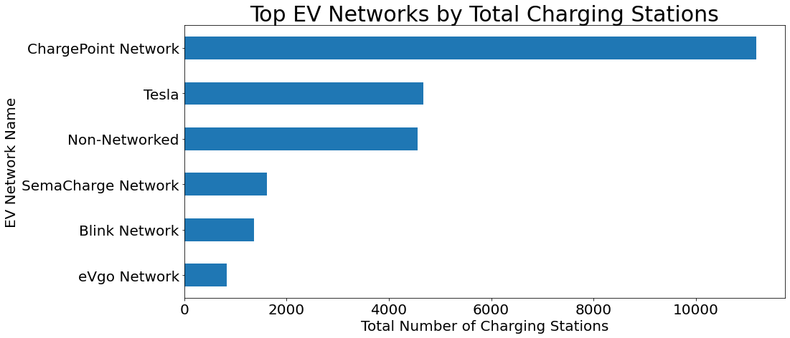
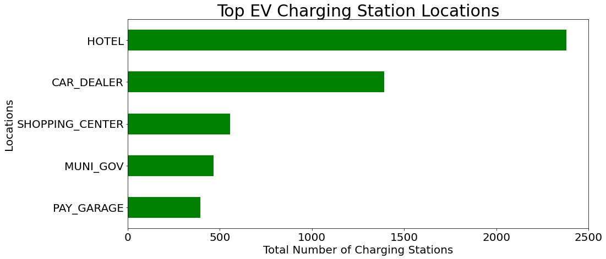
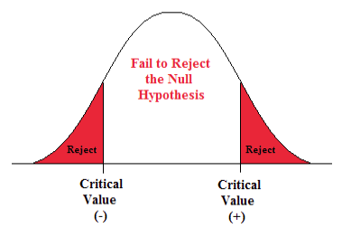
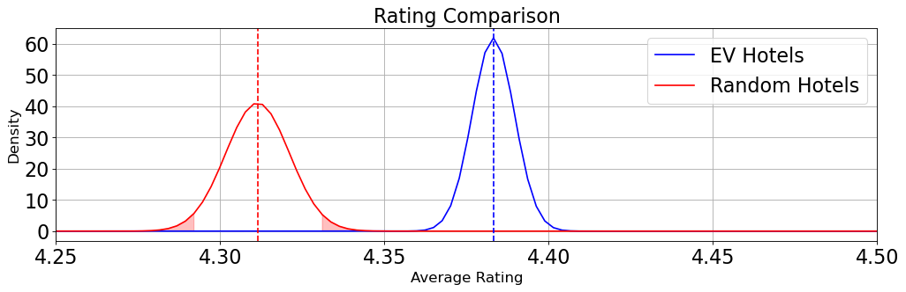
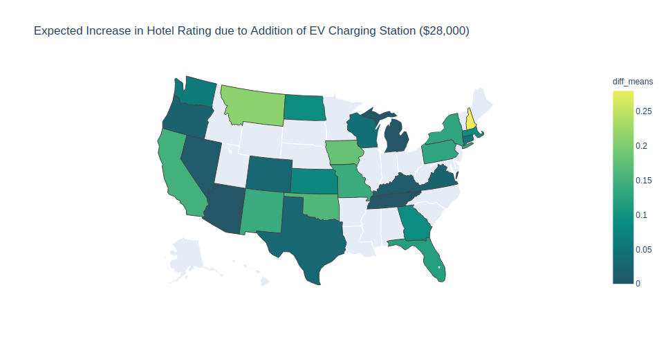
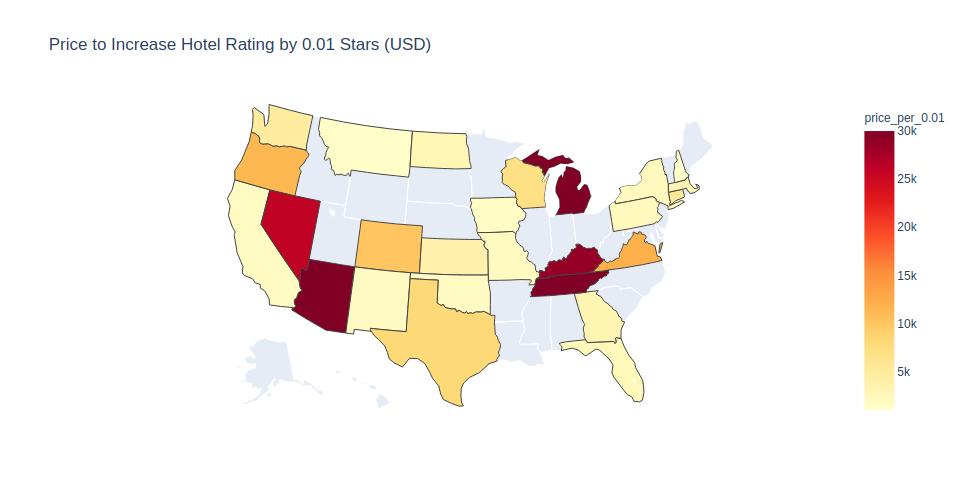

# How Electric Vehicle Charging Stations Affect Hotels Ratings

Recent years have seen the growth of the electric vehicle (EV) market and, in turn, the rise of electric charging stations. Hotels are the most popular facility to install charging ports and may be one way of monitoring the increasing public adoption. This projects will attempt to see if installing EV charging stations at hotels will effect the hotels' overall rating.

## Table of Contents

* [General Information](#general-information)
    * [Exploratory Data Analysis](#Exploratory-Data-Analysis)
    * [Hypothesis Testing](#hypothesis-testing)
    * [Software Used](#software-used)
    * [Future Improvements](#future-improvements)


## General Information
After looking through the data it was apparent that hotel parking lots are one of the most popular areas to install electric charging ports. However, it was unclear how much, if at all, these hotels were benefiting from the installation.
_______________________________________________
## Exploratory Data Analysis:

The data used to gather insight included total charging stations, most popular businesses hosting EV charging stations, total EV Network charging stations located at hotels, and all the hotel ratings data associated with the API results. This data was used to calculate mean, standard deviation, p-value and test the Null Hypothesis. The json files are located in the json folder as ```ev_hotels.json``` for the 2000 hotels with charging stations and ```gmaps_hotels.json``` for the 1000 randomly selected hotels.

Data used for this analysis was gathered from the United States Department of Energy and the Google Places API using the following techniques:

1)  CSV Cleaning:  CSV file downloaded from the US Department of Energy website contained Electric Vehicle information on over 35,000 charging station within the US and Canada.
2)  REST API: The locations of over 2000 hotel charging stations were fed into Google Places API in order to extract the hotel rating. Additionally, the location for 1000 US cities were fed into Google Places API in order to find a comparison group.

If we break down the total EV Charing Stations by network we see that ChargePoint, Tesla, and Non-Networked hold the top spot.

<p align="center" >
  
</p>

Hotels are the most popular location for EV Charing Stations and it may be worth exploring more.

<p align="center" >
  
</p>

____________________________________________________________

## Hypothesis Testing:


***Step 1: Set up the hypothesis***

Null Hypothesis: There is no significant difference (alpha of 0.05) in hotel rating based on whether the hotel has an electric vehicle charging station.

Alternative Hypothesis: There is a positive or negative change in hotel ratings based on whether the hotel has an electric vehicle charging station.

>**H0: μ = μ 0**

>**H1: μ ≠ μ 0**

***Step 2: Select test statistic***

To test this hypothesis the Welch-T test was chosen because the populations sizes were different and it was unclear whether the variances were similar.

<p align="center" >
  
</p>

***Step 3: Set up decision rule***

Reject the null hypothesis if test-statistic < -1.96 or if test-statistic > 1.96.
<p align="center">
  
</p>

***Step 4: Compute the test statistic***

P-Value: 8.83e-10  Therefore, we can reject the Null Hypothesis


<p align="center">
  
</p>

***Step 5: Conclusion***
Given a p-value of less than 0.05 we are able to reject the null-hypothesis and conclude there is meaningful evidence supporting the claim that hotels with charging stations have an effect on hotel ratings. However, considering the mean values of the data sets are so close it may not be worth adding an EV charging station for the limited increase in rating.

<p align="center">
  
</p>


<p align="center">
  
</p>


***Further Information on the analysis can be viewed within the ```Capstone1.ipynb``` file.***

_________________________________
## Software Used

***Database:***

Data Storage: Mongodb<br>

***Python:***

Data Gathering: Google API, Pandas<br>
Data Analysis: Python 3, Numpy, Pandas, Scikit-Learn, Scipy<br>

***Visualization:***

Data Visualization: Matplotlib
_______________________________________
## Future Improvements

1. Investigate hotel comments for key words that could be associated with higher ratings (EV charger mentions = higher rating?).
2. Combine current data set with other sources to gain more fidelity on price per kWh or more timeline information.


